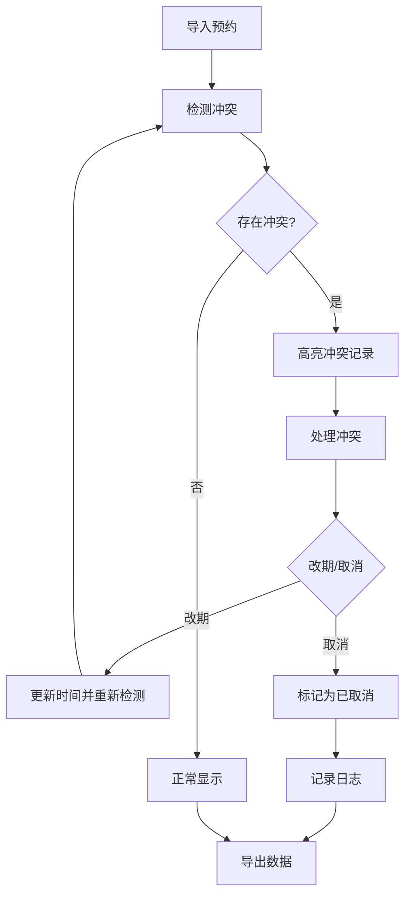
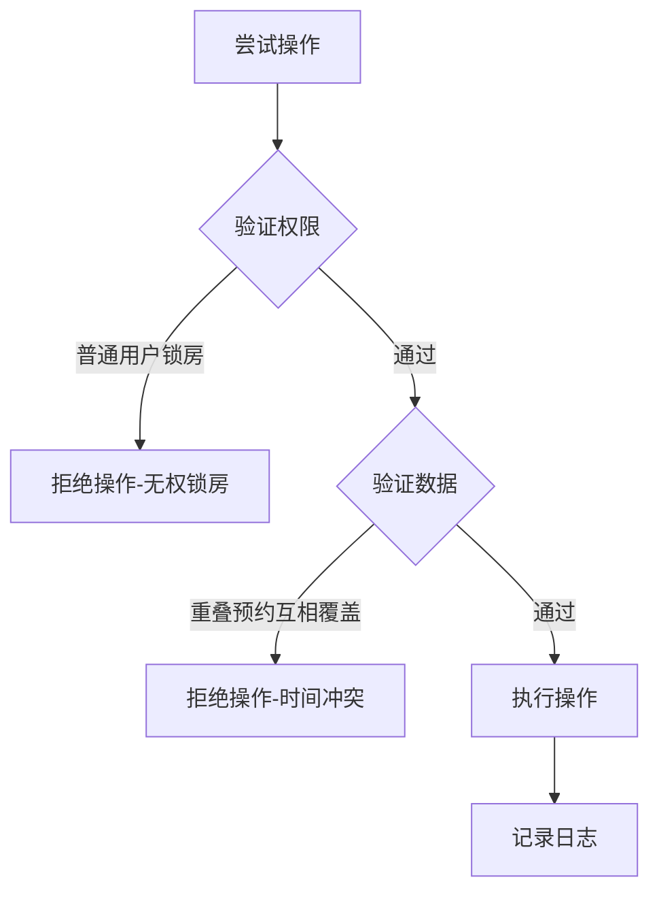

# 会议室占用冲突排查与调度台 - PRD

## 1. Product Overview

会议室占用冲突排查与调度台是一个本地可运行的 Web 控制台应用，帮助行政人员高效管理会议室预约，自动检测时间冲突，支持改期、取消、房间锁定、黑名单管理等功能，并提供完整的操作日志和数据导出能力。

## 2. Core Features

### 2.1 User Roles
| Role | Registration Method | Core Permissions |
|------|---------------------|------------------|
| Admin (行政) | 默认管理员 | 完整权限：导入预约、检测冲突、改期、取消、锁房、管理黑名单、查看日志、导出数据 |
| Normal User (普通用户) | 无需注册 | 查看预约列表，无权锁房 |

### 2.2 Feature Module
1. **预约管理**：导入预约、查看预约列表、筛选条件
2. **冲突检测**：自动识别同一会议室的时间重叠
3. **冲突处理**：改期、取消预约记录
4. **房间管理**：锁定/解锁会议室
5. **黑名单管理**：管理组织者黑名单
6. **备注处理**：添加和编辑预约备注
7. **历史日志**：记录所有操作历史
8. **数据导出**：导出预约数据和统计报告

### 2.3 Page Details
| Page Name | Module Name | Feature description |
|-----------|-------------|---------------------|
| Dashboard | 预约列表 | 展示所有预约，支持筛选（房间、时间、状态） |
| Dashboard | 冲突检测 | 高亮显示冲突预约，展示冲突链 |
| Dashboard | 操作面板 | 改期、取消、添加备注按钮 |
| Room Management | 房间列表 | 显示所有房间状态，支持锁定/解锁 |
| Blacklist | 黑名单管理 | 添加/移除组织者黑名单 |
| Logs | 历史日志 | 查看所有操作记录 |
| Export | 数据导出 | 导出预约数据和统计报告 |

## 3. Core Process

### 3.1 主流程

### 3.2 失败路径

## 4. User Interface Design

### 4.1 Design Style
- **Primary Color**: #2563eb (蓝色系，专业感)
- **Secondary Color**: #dc2626 (红色系，用于冲突警告)
- **Button Style**: Rounded corners (rounded-lg), 3D shadow effect on hover
- **Font**: Inter (现代简洁字体)
- **Layout Style**: Card-based layout with sidebar navigation
- **Icon Style**: Lucide React icons

### 4.2 Page Design Overview
| Page Name | Module Name | UI Elements |
|-----------|-------------|-------------|
| Dashboard | 预约列表 | 表格形式，冲突行高亮红色，状态标签 |
| Dashboard | 冲突检测 | 冲突链可视化，关联记录标记 |
| Room Management | 房间列表 | 卡片展示，锁定状态图标，操作按钮 |
| Blacklist | 黑名单管理 | 表格展示，添加/移除按钮 |
| Logs | 历史日志 | 时间线形式，操作类型筛选 |
| Export | 数据导出 | 导出格式选择，统计预览 |

### 4.3 Responsiveness
- Desktop-first design
- Mobile-adaptive layout (sidebar collapses to hamburger menu)
- Touch-optimized buttons and interactive elements