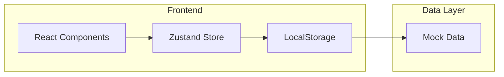
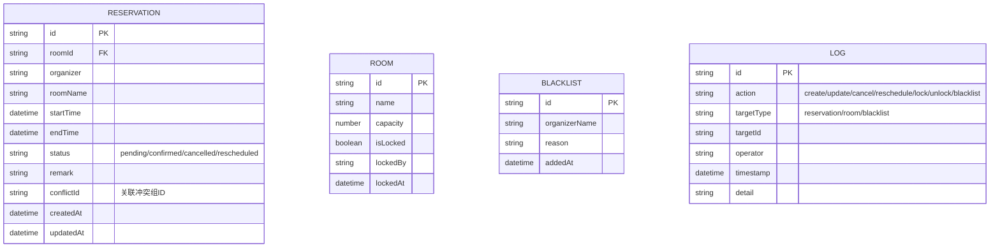

# 会议室占用冲突排查与调度台 - 技术架构文档

## 1. Architecture Design



## 2. Technology Description

- **Frontend**: React@18 + TypeScript + TailwindCSS@3 + Vite
- **State Management**: Zustand
- **Icons**: Lucide React
- **Storage**: LocalStorage (持久化数据)
- **Build Tool**: Vite

## 3. Route Definitions

| Route | Purpose |
|-------|---------|
| / | Dashboard - 主控制台，预约列表和冲突检测 |
| /rooms | Room Management - 房间管理 |
| /blacklist | Blacklist - 黑名单管理 |
| /logs | Logs - 历史日志 |
| /export | Export - 数据导出 |

## 4. Data Model

### 4.1 Data Model Definition



### 4.2 Data Definition Language (TypeScript)

```typescript
interface Reservation {
  id: string;
  roomId: string;
  roomName: string;
  organizer: string;
  startTime: string; // ISO datetime
  endTime: string; // ISO datetime
  status: 'pending' | 'confirmed' | 'cancelled' | 'rescheduled';
  remark: string;
  conflictId: string | null; // 冲突组ID
  createdAt: string;
  updatedAt: string;
}

interface Room {
  id: string;
  name: string;
  capacity: number;
  isLocked: boolean;
  lockedBy: string;
  lockedAt: string | null;
}

interface BlacklistItem {
  id: string;
  organizerName: string;
  reason: string;
  addedAt: string;
}

interface LogEntry {
  id: string;
  action: 'create' | 'update' | 'cancel' | 'reschedule' | 'lock' | 'unlock' | 'blacklist' | 'unblacklist';
  targetType: 'reservation' | 'room' | 'blacklist';
  targetId: string;
  operator: string;
  timestamp: string;
  detail: string;
}
```

## 5. Core Logic

### 5.1 冲突检测算法
1. 按房间分组预约
2. 对每个房间的预约按开始时间排序
3. 遍历检查相邻预约是否有时间重叠
4. 重叠的预约分配相同的 conflictId

### 5.2 失败路径处理
- **重叠预约覆盖检查**: 修改预约时验证新时间是否与其他预约重叠
- **权限验证**: 普通用户尝试锁房时返回错误
- **冲突链保留**: 改期后的记录保留原 conflictId，取消时记录完整冲突链

## 6. 持久化方案

使用 LocalStorage 存储所有数据：
- Key: `room-scheduler-reservations` - 预约列表
- Key: `room-scheduler-rooms` - 房间列表
- Key: `room-scheduler-blacklist` - 黑名单
- Key: `room-scheduler-logs` - 操作日志

每次数据变更后自动同步到 LocalStorage，页面加载时从 LocalStorage 读取。

## 7. 样例数据

预置样例预约数据用于演示：
- 会议室 A: 2026-06-16 09:00-10:00, 2026-06-16 09:30-10:30 (存在冲突)
- 会议室 B: 2026-06-16 14:00-15:00
- 会议室 C: 2026-06-16 10:00-11:00, 2026-06-16 11:00-12:00 (无冲突)